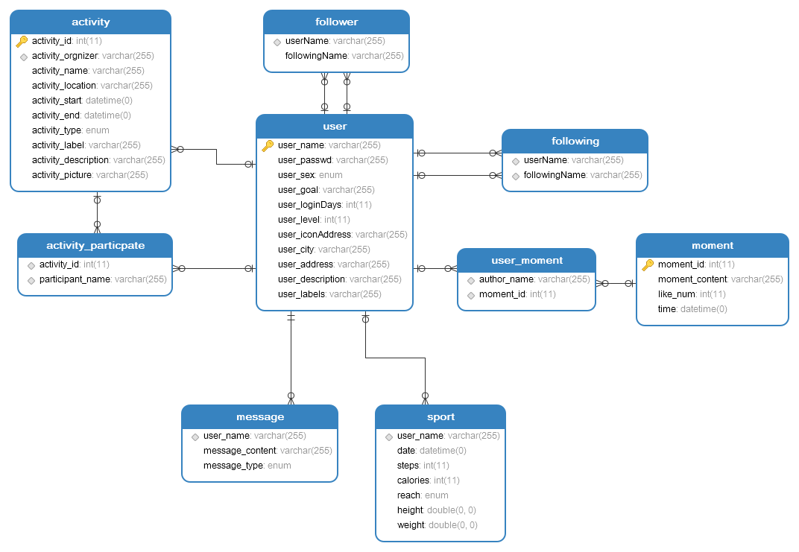

# 设计文档

[TOC]

## 1 简介

### 1.1 目的

​	本文档将从设计角度对应用做出叙述。

### 1.2 范围

​	本文档适用于代码构造以及测试人员参考使用，并将对这些活动造成影响。

### 1.3 参考资料

​	[lavravel 5.3中文文档](http://laravelacademy.org/laravel-docs-5_3)

### 1.4 使用的架构

**MVC架构**

下面会对各个层进行详细说明

## 2 框架简介

选用的Laravel的文档，下面是laravel官方文档对该框架的说明，由于本项目比较简单，有些laravel技术(例如控制台技术等)没有用到，所以我针对本项目做了部分修改

### 2.1 根目录

**App目录**

`app`目录包含了应用的核心代码，核心是http包；

**Bootstrap目录**

`bootstrap`目录包含了少许文件，用于框架的启动和自动载入配置，还有一个`cache`文件夹用于包含框架为提升性能所生成的文件，如路由和服务缓存文件；

**Config目录**

`config`目录包含了应用所有的配置文件；

**Database目录**

`database`目录包含了数据迁移及填充文件；

**Public目录**

`public`目录包含了入口文件`index.php`和`common`包，里面放着前端文件(CSS,JavaScript,图片)；

**Resources目录**

`resources`目录包含了视图文件；

**Routes目录**

`routes` 目录包含了应用的所有路由定义。Laravel默认提供了三个路由文件：`web.php`、`api.php`和`console.php`，本项目主要使用web.php中定义的路由。

`web.php`文件包含的路由都会应用web中间件组，具备Session、CSRF防护以及Cookie加密功能，如果应用无需提供无状态的、RESTful风格的API，所有路由都会定义在`web.php`文件。

`api.php` 文件包含的路由应用了`api`中间件组，具备频率限制功能，这些路由是无状态的，所以请求通过这些路由进入应用需要通过token进行认证并且不能访问Session状态。

`console.php` 文件用于定义所有基于闭包的控制台命令，每个闭包都被绑定到一个控制台命令并且允许与命令行IO方法进行交互，尽管这个文件并不定义HTTP路由，但是它定义了基于控制台的应用入口（路由）。

**Storage目录**

`storage`目录包含了编译过的Blade模板、基于文件的session、文件缓存，以及其它由框架生成的文件，该目录被细分为成`app`、`framework`和`logs`子母录，`app`目录用于存放应用要使用的文件，`framework`目录用于存放框架生成的文件和缓存，最后，`logs`目录包含应用的日志文件；

`storage/app/public` 目录用于存储用户生成的文件，比如可以被公开访问的用户头像，要达到被访问的目的，你还需要在`public`目录下生成一个软连接 `storage` 指向这个目录。你可以通过 `php artisan storage:link` 命令生成这个软链接。

**Tests目录**

`tests`目录包含自动化测试，其中已经提供了一个开箱即用的[PHPUnit](https://phpunit.de/)示例；每一个测试类都要以 Test 开头，你可以通过 `phpunit` 或 `php vendor/bin/phpunit` 命令来运行测试。

**Vendor目录**

`vendor`目录包含[Composer](https://getcomposer.org/)依赖。

### 2.3 核心目录:APP目录

应用的核心代码位于`app`目录下，默认情况下，该目录位于命名空间 App 下，  并且被 Composer 通过 [PSR-4自动载入标准](http://www.php-fig.org/psr/psr-4/) 自动加载。

`app`目录下包含多个子目录，如`Console`、`Http`、`Providers`等。`Console`和`Http`目录提供了进入应用核心的API，HTTP协议和CLI是和应用进行交互的两种机制，但实际上并不包含应用逻辑。换句话说，它们只是两个向应用发布命令的方式。`Console`目录包含了所有的Artisan命令，`Http`目录包含了控制器、中间件和请求等。

其他目录将会在你通过Artisan命令make生成相应类的时候生成到`app`目录下。例如，`app/Jobs`目录直到你执行 `make:job` 命令生成任务类时才会出现在`app`目录下。

> 注意：`app`目录中的很多类都可以通过Artisan命令生成，要查看所有有效的命令，可以在终端中运行`php artisan list make`命令。

**Console目录**

`Console`目录包含应用所有自定义的Artisan命令，这些命令类可以使用`make:command`命令生成。该目录下还有console核心类，在这里可以注册自定义的Artisan命令以及定义调度任务。

**Exceptions目录**

`Exceptions`目录包含应用的异常处理器，同时还是处理应用抛出的任何异常的好地方。如果你想要自定义异常如何记录异常或渲染，需要修改 Handler 类。

**Http目录**

`Http` 目录包含了控制器、中间件以及表单请求等，几乎所有进入应用的请求处理都在这里进行。

**Providers目录**

`Providers` 目录包含应用的所有服务提供者。服务提供者在启动应用过程中绑定服务到容器、注册事件以及执行其他任务以为即将到来的请求处理做准备。

在新安装的Laravel应用中，该目录已经包含了一些服务提供者，你可以按需添加自己的服务提供者到该目录。

## 3. Controller

### 3.1 设计目标原则

​	本网站基于laravel5.3提供的框架，遵循laravel5.3的各项原则，大体上按照用例划分模块，每个模块对应一个控制器和若干前端页面。由于应用比较简单，耦合度较低，所以model层的设计并没有分模块，将在后面详述。


### 3.2 用户管理模块

- 对应用例中的个人设置，好友设置和账号设置，并负责用户的注册，登入，登出等功能
- 对应控制器由系统自动提供，存在验证的Auth包中
- 可以访问的数据库表包括user表等

### 3.3 用户运动模块

- 对应用例的查看运动情况，查看身体情况等
- 对应控制器SportController
- 可以访问的数据库表包括sport，user等

**接口**

```php
//根据username初始化Sport界面的view，必做
public function index(){
    return view("sport");
}
//保存录入身体情况，必做
public function storeInfo(){

}
```

### 3.4 活动模块

- 对应用例的创建活动，编辑活动等
- 对应控制器ActivityController
- 可以访问的数据库表包括activity，user，activity_participate等

**接口**

```php
//根据username初始化activity的界面，必做
public function index(){
	return view("activity");
}
//添加活动 必做
public function createActivity(){

}
//参加活动 必做
public function joinActivity(){

}
//编辑活动 选做
public function editActivity(){

}
```

### 3.5 好友模块

- 对应用例的查看好友，添加好友
- 对应控制器PeopleController
- 可以访问的数据库表包括people，user等

**接口**

```php
//根据username初始化圈子界面，必做
public function index(){
    return view("people");
}
//删除好友，必做
public function deleteFollowing(){

}
//添加好友 必做
public function addFollowing(){

}
```

### 3.6 圈子模块

- 对应用例的发表状态
- 对应控制器MomentsController
- 可以访问的数据库包括moments，user，user_moments

**接口**

```php
//根据username初始化moments界面
public function index(){
    return view("moments");
}
//发表状态
public function addMoments(){

}
```

### 3.7 消息模块

- 负责将系统的消息通知给用户
- 对应控制器MessageController
- 可以访问的数据库表包括user，message等

**接口**

```php
//根据username初始化信息界面
public function index(){
    return view("message");
}
```

## 2 View

​	View层使用了laravel框架提供的方便的Blade模板，可以方便的共享相同的组件。通过`yield` `section`等标签，实现前端的文件的复用

​	详细的原型设计见*原型*。

## 3 Model
Model层使用了laravel自带的DB，在配置了一些参数之后可以使用DB的select等方法。

**ER-图**




