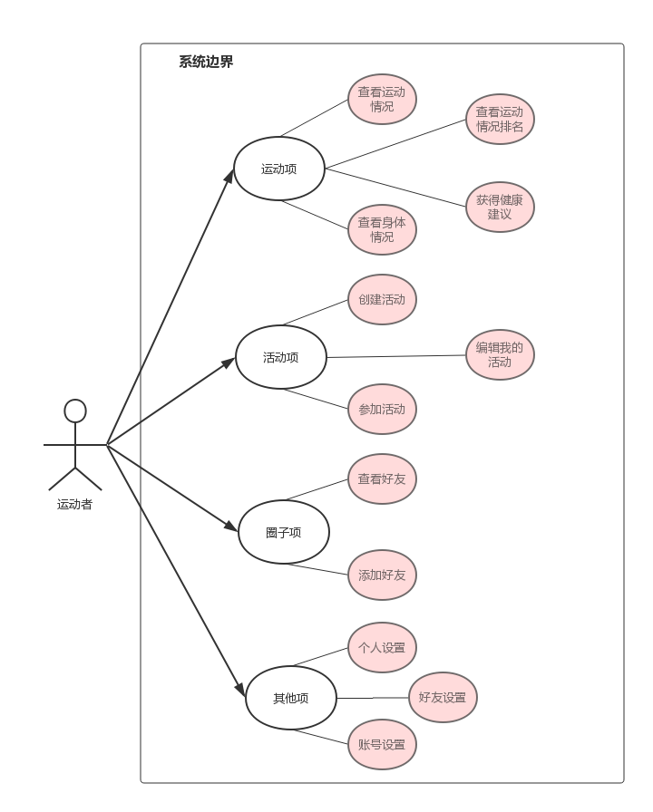

# 用例文档

##目录
[TOC]

## 用例图

## 用例说明

###模板
| 项目   | 内容                                      |
| ---- | --------------------------------------- |
| 用例名称 | *用例名应是一个动词短语，应让读者一目了然地从名字中就可以知道该用例的目标。* |
| 编号   | *UCx*                                   |
| 使用语境 | *用例目标，是一个较长的描述，甚至包括触发条件。*               |
| 优先级  | *1-10,开发时适当考虑先后*                        |
| 正常流程 | *正常的用户-系统响应*                            |
| 扩展流程 | *非正常的用户-系统响应*                           |
| 备注   | *备注*                                    |

### 1 查看运动情况
| 项目   | 内容                                       |
| ---- | ---------------------------------------- |
| 用例名称 | *查看运动情况*                                 |
| 编号   | *UC1*                                    |
| 使用语境 | *用户可以查看自己当天的运动情况，包括运动步数，运动时间和燃烧热量，以及是否达到目标* |
| 优先级  | *10*                                     |
| 正常流程 | *1.用户请求查看自己当天的运动情况 2.系统返回该用户当天的运动详情以及目标达成情况和历史数据统计图* |
| 扩展流程 | *用户还没有设置目标 其他数据照常返回，目标达成情况提示未设置目标*    |
| 备注   | *对运动情况能有一个比较形象的清晰的说明(相当于干了……事情)*         |

### 2 查看运动情况排名
| 项目   | 内容                                       |
| ---- | ---------------------------------------- |
| 用例名称 | *查看运动情况排名*                               |
| 编号   | *UC2*                                    |
| 使用语境 | *用户可以查看自己当天运动情况的排名，包括好友排名和全站排名*          |
| 优先级  | *8*                                      |
| 正常流程 | *1.用户请求查看自己的运动情况排名 2.系统返回该用户运动步数的好友排名和全站排名* |
| 扩展流程 | *用户还没有好友 系统提示用户还没有好友并提供链接到添加好友功能*     |
| 备注   | *系统可以有一些鼓励或者称赞*                          |

### 3 查看健康情况
| 项目   | 内容                                       |
| ---- | ---------------------------------------- |
| 用例名称 | *查看健康情况*                                 |
| 编号   | *UC3*                                    |
| 使用语境 | *用户可以通过输入自己的身高体重，获悉自己的健康情况*              |
| 优先级  | *9*                                      |
| 正常流程 | *1.用户输入自己的身高体重 2.系统返回该用户的BMI指数，并指出其所在的范围* |
| 扩展流程 | *BMI指数出现问题不在范围内 系统把BMI指数固定在端点，并提示用户输入可能有误* |
| *备注* | *有一些可视化的数据展现形式*                          |

### 4 获得健康建议
| 项目   | 内容                                       |
| ---- | ---------------------------------------- |
| 用例名称 | *获得健康建议*                                 |
| 编号   | *UC4*                                    |
| 使用语境 | 用户在获得自己的健康情况之后，可以获得系统自动做出的健康建议           |
| 优先级  | *6*                                      |
| 正常流程 | *1.用户输入自己的身高体重 2.系统给出用户的理想体重，并结合用户的目标运动步数给出健康建议(多吃，多动，少吃，适量运动)* |
| 扩展流程 | *用户还没有设置目标步数 系统提照常给出建议但是提示用户未设置目标步数可能不能准确* |
| 备注   |                                          |

### 5 创建活动
| 项目   | 内容                                       |
| ---- | ---------------------------------------- |
| 用例名称 | *创建活动*                                   |
| 编号   | *UC5*                                    |
| 使用语境 | *用户可以发起一项活动(竞赛),以便其他用户参与*                |
| 优先级  | *9*                                      |
| 正常流程 | *1.用户选择发起一项活动 2.系统反馈创建活动的表单 3.用户填写表单 4.系统返回创建活动成功* |
| 扩展流程 | *1.用户在过程中取消创建活动 系统不做处理反馈取消创建 2.用户填写的信息有误 系统提示出错位置* |
| 备注   | *希望多缺省选项*br                              |

### 6 参加活动
| 项目   | 内容                                       |
| ---- | ---------------------------------------- |
| 用例名称 | *参加活动*                                   |
| 编号   | *UC6*                                    |
| 使用语境 | *用户可以选择一项活动并参加*                          |
| 优先级  | *9*                                      |
| 正常流程 | *1.用户请求参加活动 2. 系统返回按照时间排序的活动列表 3.用户选择某个活动参与 4.系统提示参与成功* |
| 扩展流程 | *1. 用户参与的活动因为人数已满或者等等原因参与失败 系统返回参与失败* |
| 备注   | *活动的排序方式可以按照自己选择*                        |

### 7 编辑我的活动
| 项目   | 内容                                       |
| ---- | ---------------------------------------- |
| 用例名称 | *编辑我的活动*                                 |
| 编号   | *UC7*                                    |
| 使用语境 | *用户可以选择编辑我的活动*                           |
| 优先级  | *6*                                      |
| 正常流程 | *1.用户选择编辑自己创建的活动 2.系统返回该用户创建的所有活动 3.用户选择某项活动 4.系统给出表单 5.用户编辑信息并提交 6.系统返回编辑成功* |
| 扩展流程 | *用户还没有创建活动 系统返回提示信息*                  |
| 备注   | *有些信息不支持修改，比如活动时间等*                      |

### 8 查看好友
| 项目   | 内容                                |
| ---- | --------------------------------- |
| 用例名称 | *查看好友*                            |
| 编号   | *UC8*                             |
| 使用语境 | *用户可以查看自己的好友列表*                   |
| 优先级  | *8*                               |
| 正常流程 | *1.用户请求查看自己的好友 2.系统返回该用户的好友列表* |
| 扩展流程 | *用户没有好友时，系统做出提示*                  |
| 备注   |                                   |

### 9 添加好友
| 项目   | 内容                                       |
| ---- | ---------------------------------------- |
| 用例名称 | *添加好友*                                   |
| 编号   | *UC8*                                    |
| 使用语境 | *用户可以添加自己的好友*                            |
| 优先级  | *7*                                      |
| 正常流程 | *1.用户可以选择通过输入好友昵称添加好友 2.系统返回该用户情况 3.用户也可以通过系统推荐的好友添加好友* |
| 扩展流程 | *1.好友昵称不存在 系统提示用户不存在*                 |
| 备注   | *可以修改自己的推荐偏好，详见10*                       |

### 10 个人设置
| 项目   | 内容                                       |
| ---- | ---------------------------------------- |
| 用例名称 | *个人设置*                                   |
| 编号   | *UC10*                                   |
| 使用语境 | *用户可以查看修改自己的个人信息*                        |
| 优先级  | *9*                                      |
| 正常流程 | *1.用户选择修改自己的个人信息 2.系统返回表单 3.用户修改信息提交 4.系统返回成功* |
| 扩展流程 |                                          |
| 备注   | *昵称不能修改*                                 |

### 11 好友设置

| 项目   | 内容                                       |
| ---- | ---------------------------------------- |
| 用例名称 | *好友设置*                                   |
| 编号   | *UC10*                                   |
| 使用语境 | *用户可以设置自己圈子方面的默认设置*                      |
| 优先级  | *5*                                      |
| 正常流程 | *1.用户选择修改好友设置 2.系统返回表单 3.用户修改信息提交 4.系统返回成功* |
| 扩展流程 |                                          |
| 备注   | *可以修改的信息包括隐私，推荐偏好等等*                     |

### 12 账号设置

| 项目   | 内容                                       |
| ---- | ---------------------------------------- |
| 用例名称 | *账号设置*                                   |
| 编号   | *UC11*                                   |
| 使用语境 | *用户可以自改自己的账号信息*                          |
| 优先级  | *3*                                      |
| 正常流程 | *1.用户选择修改好友设置 2.系统返回表单 3.用户修改信息提交 4.系统返回成功* |
| 扩展流程 |                                          |
| 备注   | *可以修改的信息仅包括密码*                           |